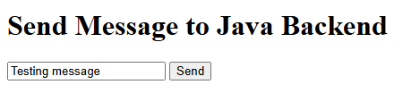
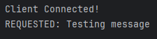

# Design Document

#### Section 1: Project Description

The main goal of this project is to have a game with a client and server side component. The client-side will be done via JavaScript using the Canvas library, the server-side will be done using Java. API calls will be used to determine certain events such as random events (loot-tables, percent-hit, etc) and the client-side will react to the response of these calls.

If fast enough calls can be made with the use of open socket connections, an additional player will be able to join a game session.

#### Section 2: Overview
The game will be played via Canvas (HTML / JS), through the browser, the browser will communicate using HTTP to a JS relay run via Bun (or Node), the outputs / inputs will be sent over TCP to the Java server. If necessary I will switch to a websocket approach which would allow for direct communication between the browser game and the Java server, though this may not be necessary.
The game will be a platformer where the player can find loot. The loot will be randomly chosen from a loot-table on the server side and sent to the client.

#### Section 3: System Architecture
- Frontend: Data is collected from an HTML form.
- Backend: Data is received via HTTP POST requests and then sent over a TCP connection.
- Java Backend Server: Data is received via TCP and processed accordingly.

#### Section 4: Data Dictionary
- Message: the message being sent from the HTML/JS front end through the Express relay to the Java backend
- Player Character: the in-game object representing the player, controllable using WASD keys and space bar
More to follow, this current build is a test regarding cross-platform communication

#### Section 5: Data Design
¯\\_(ツ)_/¯

#### Section 6: User Interface Design
- A text input that holds the message to be sent to the backend server with a button to send the message
- A red box that represents the player
More to follow, this current build is a test regarding cross-platform communication

#### Section 7: Images

Java console log (message received)

